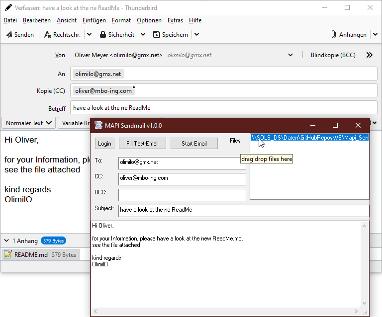

# Mapi_Sendmail
## Open your standard email client with Mapi and prepare email for sending  
No email will be sent unless you click send in your email program. 
The email will just be prepared for sending in your standard-email client.
Works e.g. with Outlook oder Thunderbird.
Project started in march 2017

